# Yarn Guardian

Yarn Guardian is a little helper app to keep your yarns, hooks and needles in order. Perfect for crafters!

## Strategy
User can use this app to write upp information of all the yarns and other supplies they own. They can search uploaded information to see what they already own.


## Scope
### User Stories:
- [As a User I can login to my account so that I can use the app](https://github.com/CozyPlantlady/yarn-guardian/issues/4)
- [As a user I can look my stash board so that I know what items I have](https://github.com/CozyPlantlady/yarn-guardian/issues/2)
- [As a user I can see the different qualities of yarns when I search for them so that I know what to choose](https://github.com/CozyPlantlady/yarn-guardian/issues/6)
- [As a User I can add new items so that I can keep stash up to date](https://github.com/CozyPlantlady/yarn-guardian/issues/9)
- [As a user I can edit item information so that I can keep it up to date](https://github.com/CozyPlantlady/yarn-guardian/issues/20)
- [As a user I can delete an item so that I can keep my stash up to date](https://github.com/CozyPlantlady/yarn-guardian/issues/21)
- [As a User I can edit an item that has been used up so that information is up to date](https://github.com/CozyPlantlady/yarn-guardian/issues/50)
- [As a User I can create a new project so that I can plan which yarns to use](https://github.com/CozyPlantlady/yarn-guardian/issues/22)
- [As a User I can edit a project so that I can keep it up to date](https://github.com/CozyPlantlady/yarn-guardian/issues/23)
- [As a user I can add notes about the yarn so that I remember important things about it](https://github.com/CozyPlantlady/yarn-guardian/issues/57)
- [As a User I can delete a project so that information is up to date](https://github.com/CozyPlantlady/yarn-guardian/issues/32)
- Mark project as finished
- See finished projects
- Mark favorite yarns with a star
- Mark yarns that has been frogged (used, but unraveled and ready to be used again)
- See how much of yarn has been used
- See how much yarn is logged (and ready to be used)

### Used Installments:
Django and Gunicorn

```
pip3 install 'django<4' gunicorn
```
Postgres
```
pip3 install dj_database_url==0.5.0 psycopg2
```
Cloudinary
```
pip3 install dj3-cloudinary-storage
```
Summernote
```
pip3 install django-summernote
```
Django User Authentication
```
pip3 install django-allauth
```
Crispy Forms
```
pip3 install django-crispy-forms
```
## Structure

### Site Structure
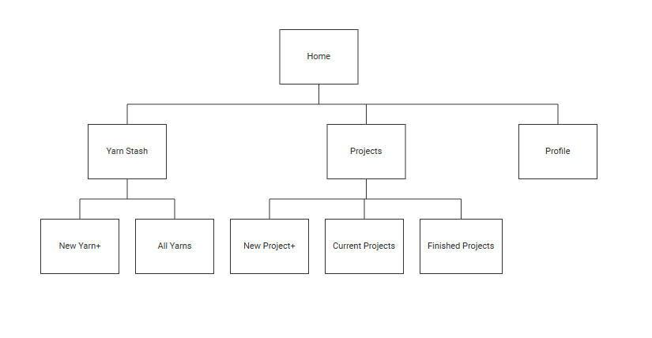


### Data Structure

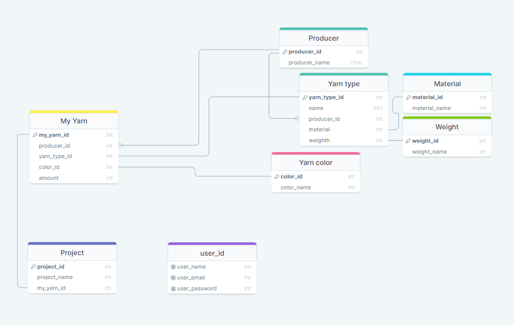

## Skeleton:

### Mobile

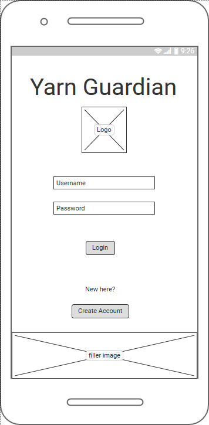
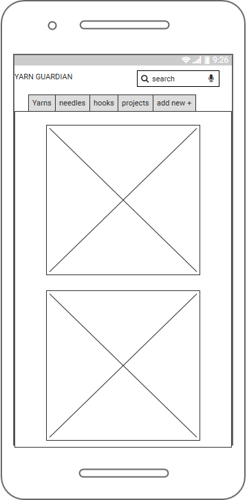
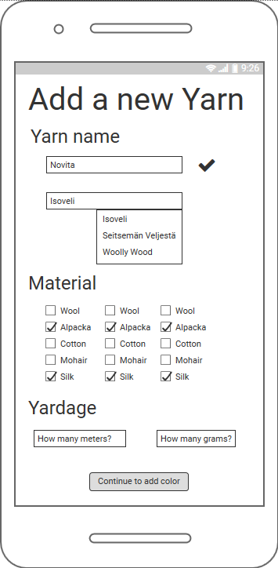
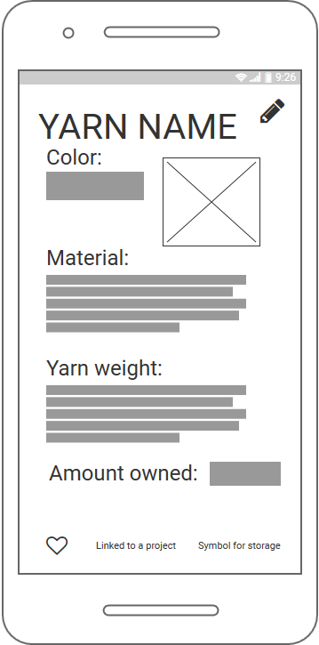
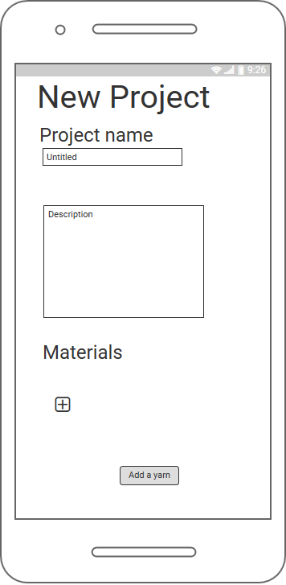
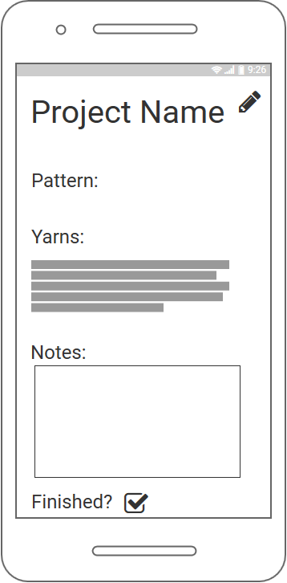


### Tablet 

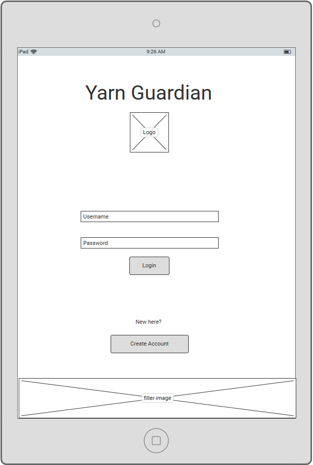
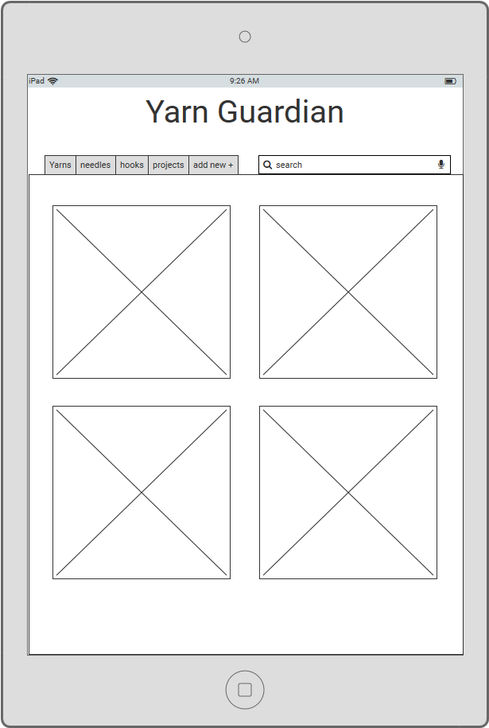
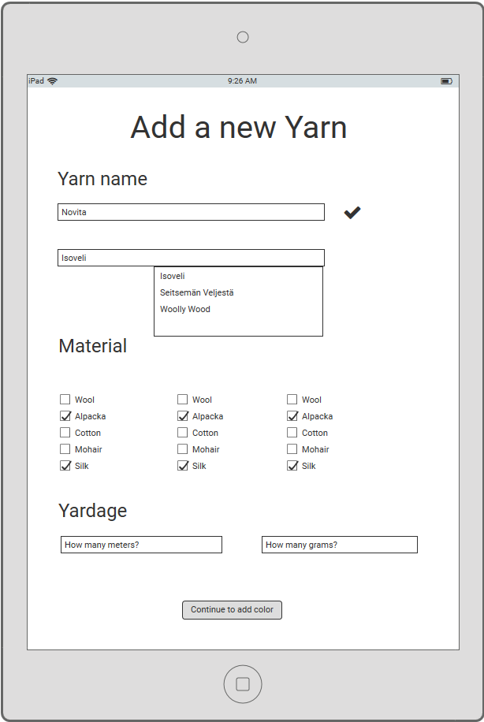
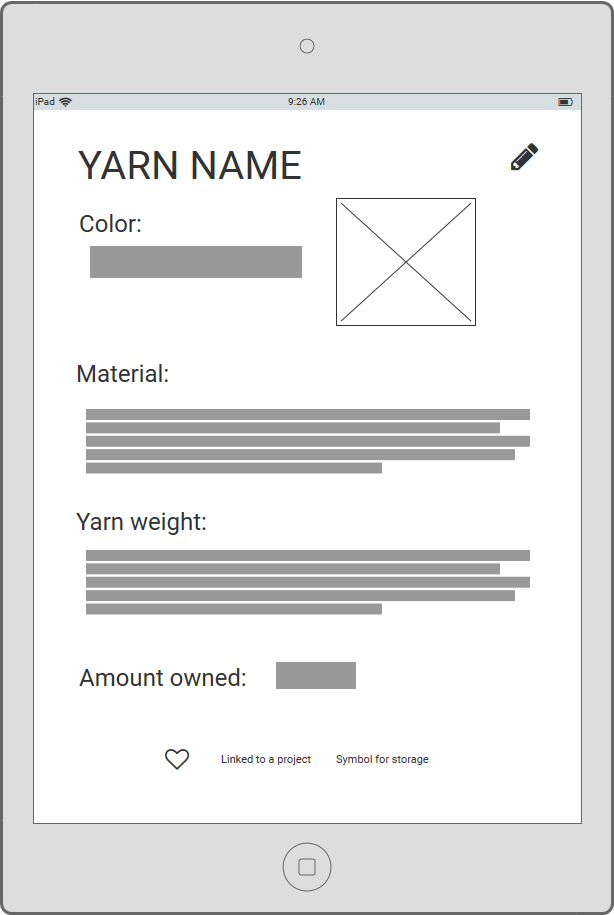
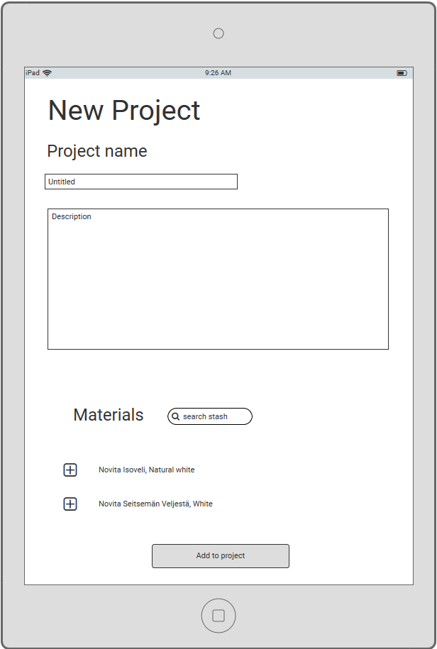
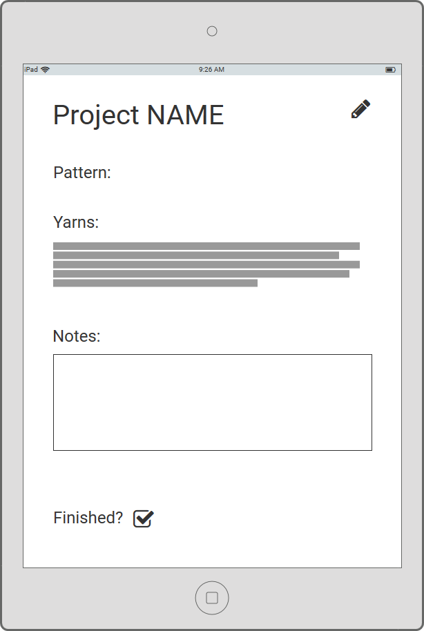

### Laptop 

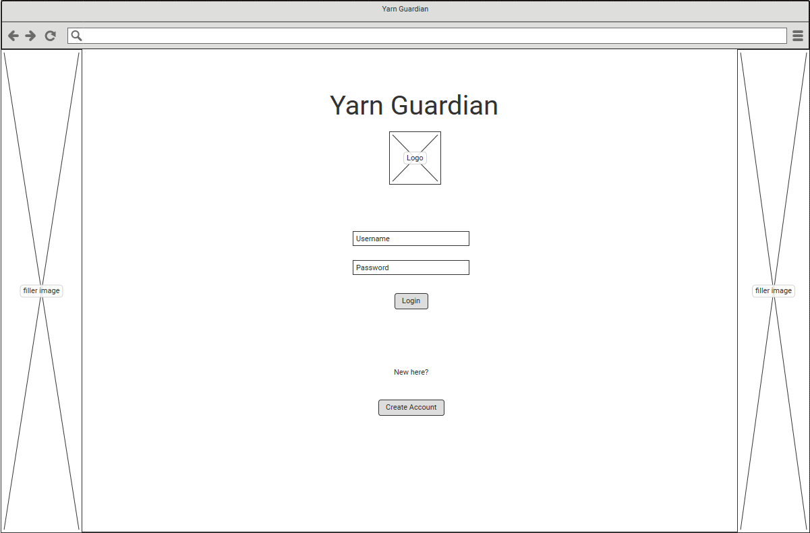
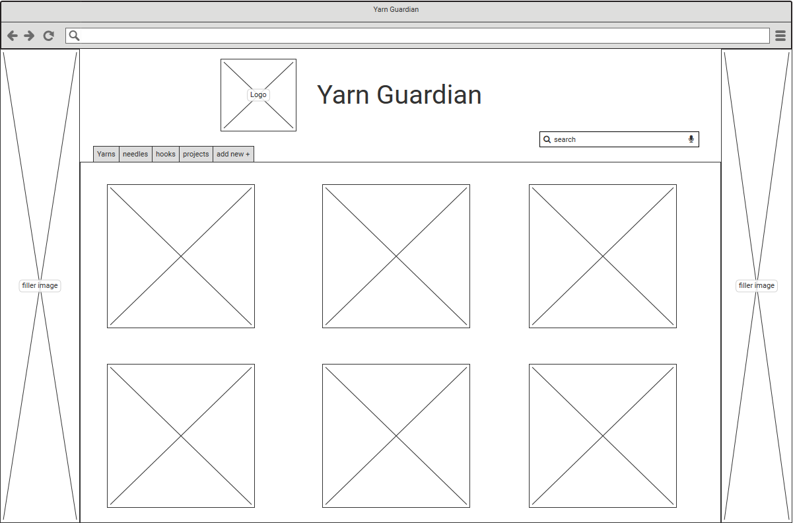
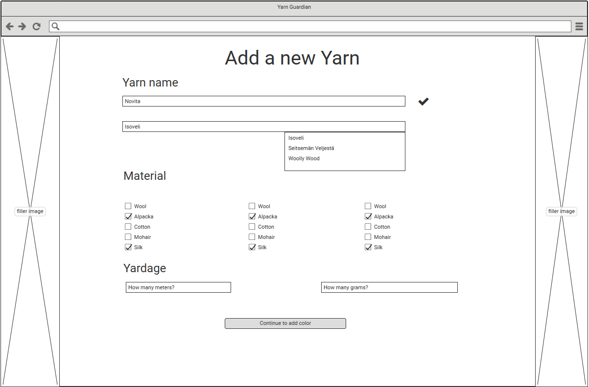
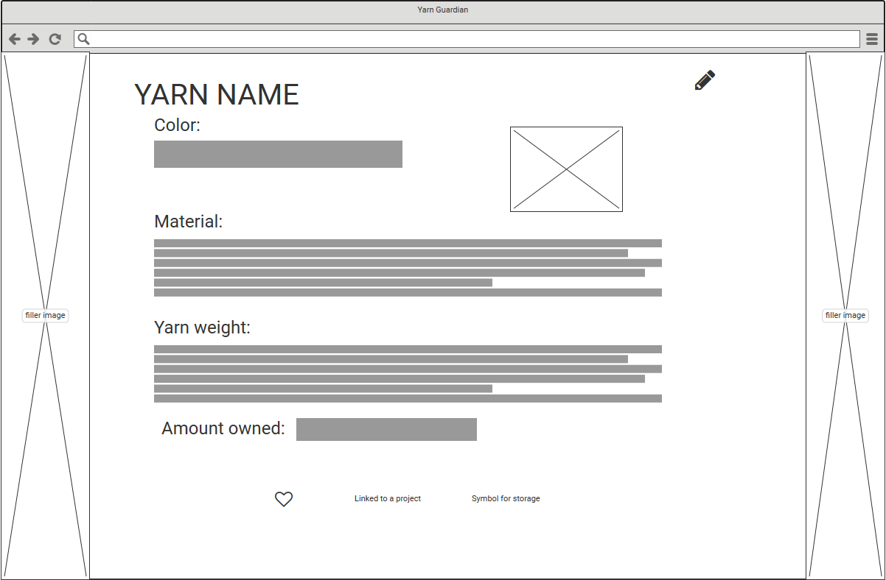
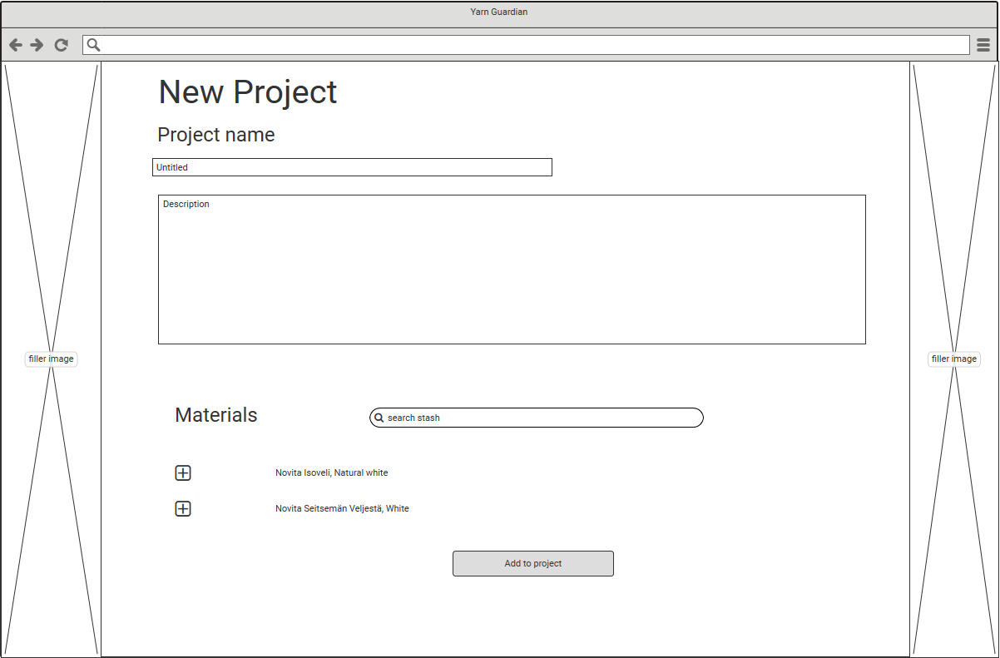
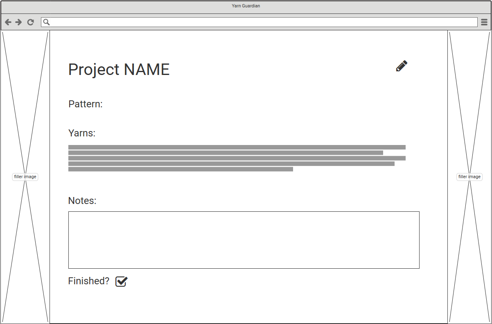


## Surface:

### Colors: 

### Fonts: 

### Favicon


## TESTING

### User Stories:
https://github.com/users/CozyPlantlady/projects/5

### Automated testing test_forms.py:
Using **Djangos** build-in **TestCase** for automated testing.
**AddYarnForm** is tested for required fields *producer* and *name*. Test shows that form is not valid if these fields are not filled.
**AddYarnForms** fields are also tested that they match with Yarn modules fields.cThese tests pass without problem.

### Automated testing test_views.py:
Goal is to test that every html-page opens correctly, but run into trouble when view wanted a validated user. 

TypeError: 'AnonymousUser' object is not iterable

Currently working tests:
Home page loads correctly.
User Page loads correctly.


### Bugs and other issues:
- [Make stash visible only if user in logged in](https://github.com/CozyPlantlady/yarn-guardian/issues/67)
- [Yarn is not user specific](https://github.com/CozyPlantlady/yarn-guardian/issues/68)
- [Admin can add yarns, user can not](https://github.com/CozyPlantlady/yarn-guardian/issues/69)
- [Editing Yarn and Projects mix up](https://github.com/CozyPlantlady/yarn-guardian/issues/72)
- [Can't run tests](https://github.com/CozyPlantlady/yarn-guardian/issues/73)
- [User have to choose yarn as favorite](https://github.com/CozyPlantlady/yarn-guardian/issues/74)
- [Color option shows up as "WH"](https://github.com/CozyPlantlady/yarn-guardian/issues/75)
-[Bootstrap navbar isn't working on smaller screens](https://github.com/CozyPlantlady/yarn-guardian/issues/80)
- [Modal doesn't show yarn.body text](https://github.com/CozyPlantlady/yarn-guardian/issues/82)

### Possible features to add

This tiny app could be made so much bigger. It could be social platform where people can share their current projects. It would highly benefit from letting user download pictures, both of their yarns and their projects. Possibility to have a code word or symbol by the yarn information, so that user can use that as a key when organising their stash at home.

### Testing with code validators


## DEPLOYMENT

### Before deploying
Before deploying make sure that all the needed installments can be found from *requirements.txt* file.
```
pip3 freeze --local > requirements.txt
```

### GitHub
For the deployment to Heroku to work, it's important to have the final version of the project pushed to GitHub. 
- *git add .* *git commit* and *git push* to make sure you have the latest changes in Github.

### Heroku
After logging in to **Heroku** choose *New*-button on the top right side of the screen, and choose *New app*

Choose the name off the app. This project is **yarn-guardian**.

Choose your region 
- Mine is *Europe*.

Next to the **Settings**. You can find it from the *navigation bar*. Locate *Buildpacks*, and choose Python and NodeJs, in that order.

Still in *Settings*, locate *Config Vars*. 
- In this project we have **PORT** as 8000, as well as **SECRET_KEY**, **CLOUDINARU_URL** and **DATABASE_URL** that connect to our env.py file.

Changes are saved automatically.

Time to **Deploy**! Choose *Deploy* from *navigation bar*.

This projects chosen **Deployment method** is by being **Connected to GitHub**. 

After you are connected, give the name you used for your project in **GitHub**
- This project is *yarn-guardian* in **GitHub**.

For this project I chose to deploy early, and Github update data to Heroku every time I made a new commit and push.


## CREDITS

### Mentor: 
Once again, thank you [Simen Daehlin](https://github.com/Eventyret/eventyret) for being my mentor!

## CODE CREDITS

[Modal, Varying modal content](https://mdbootstrap.com/docs/standard/components/modal/)

```
const yarnModal = document.getElementById('yarnModal');
yarnModal.addEventListener('show.mdb.modal', (e) => {
  // Button that triggered the modal
  const button = e.relatedTarget;
  // Extract info from data-mdb-* attributes
  const recipient = button.getAttribute('data-mdb-whatever');
  // If necessary, you could initiate an AJAX request here
  // and then do the updating in a callback.
  //
  // Update the modal's content.
  const modalTitle = yarnModal.querySelector('.modal-title');
  const modalBodyInput = yarnModal.querySelector('.modal-body input');

  modalTitle.textContent = `New message to ${recipient}`;
  modalBodyInput.value = recipient;
})
```

## Thank you for reading!