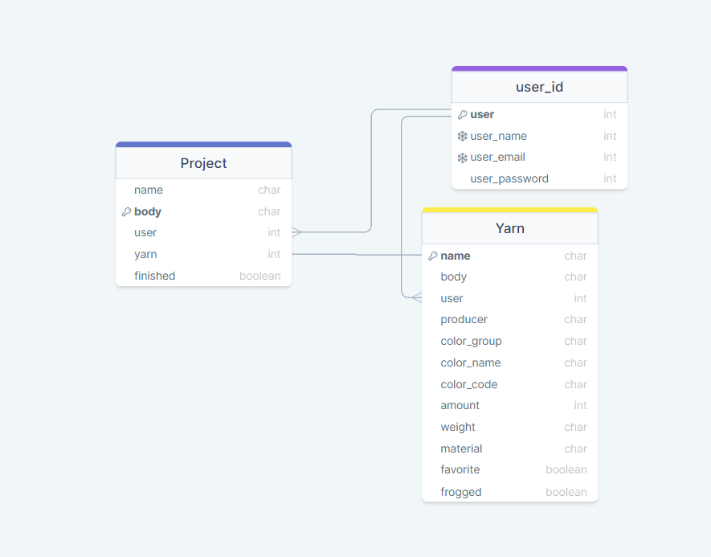
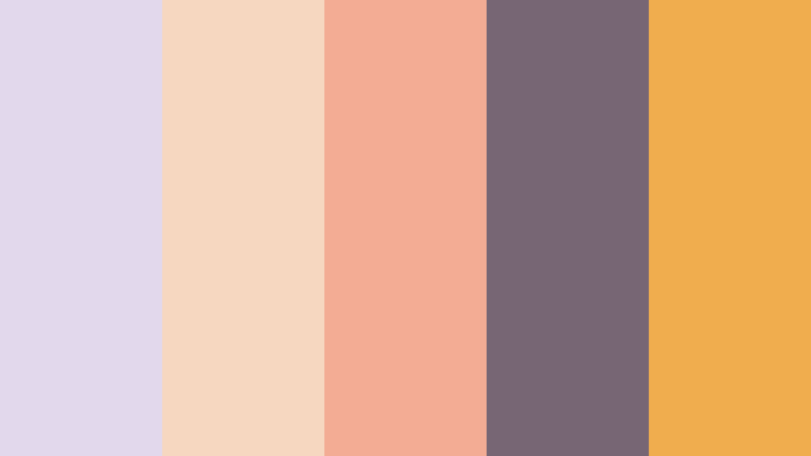
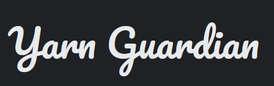
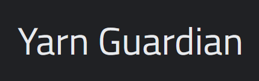

# Yarn Guardian

Yarn Guardian is a little helper app to keep your yarns and projects in order. Perfect for crafters!

## Strategy
User can use this app to write up information of all the yarns they own. They can search uploaded information to see what they already own.


## Scope
### User Stories:
- [As a User I can login to my account so that I can use the app](https://github.com/CozyPlantlady/yarn-guardian/issues/4)
- [As a user I can look my stash board so that I know what items I have](https://github.com/CozyPlantlady/yarn-guardian/issues/2)
- [As a user I can see the different qualities of yarns when I search for them so that I know what to choose](https://github.com/CozyPlantlady/yarn-guardian/issues/6)
- [As a User I can add new items so that I can keep stash up to date](https://github.com/CozyPlantlady/yarn-guardian/issues/9)
- [As a user I can edit item information so that I can keep it up to date](https://github.com/CozyPlantlady/yarn-guardian/issues/20)
- [As a User I can tag yarn as a favorite so that I can find it easier](https://github.com/CozyPlantlady/yarn-guardian/issues/54)
- [As a User I can tag yarn as frogged so that I know it has been used before](https://github.com/CozyPlantlady/yarn-guardian/issues/55)
- [As a user I can delete an item so that I can keep my stash up to date](https://github.com/CozyPlantlady/yarn-guardian/issues/21)
- [As a User I can edit an item that has been used up so that information is up to date](https://github.com/CozyPlantlady/yarn-guardian/issues/50)
- [As a User I can create a new project so that I can plan which yarns to use](https://github.com/CozyPlantlady/yarn-guardian/issues/22)
- [As a User I can edit a project so that I can keep it up to date](https://github.com/CozyPlantlady/yarn-guardian/issues/23)
- [As a user I can add notes about the yarn so that I remember important things about it](https://github.com/CozyPlantlady/yarn-guardian/issues/57)
- [As a User I can delete a project so that information is up to date](https://github.com/CozyPlantlady/yarn-guardian/issues/32)
- [As a user I can mark project as finished so that I can keep information up to date](https://github.com/CozyPlantlady/yarn-guardian/issues/25)
- [As a user I can see all my finished projects so that I can see what I have done](https://github.com/CozyPlantlady/yarn-guardian/issues/26)


### Used Installments:
Django and Gunicorn

```
pip3 install 'django<4' gunicorn
```
Postgres
```
pip3 install dj_database_url==0.5.0 psycopg2
```
Cloudinary
```
pip3 install dj3-cloudinary-storage
```
Summernote
```
pip3 install django-summernote
```
Django User Authentication
```
pip3 install django-allauth
```
Crispy Forms
```
pip3 install django-crispy-forms
```
## Structure

### Site Structure


### Data Structure



## Skeleton:

### Mobile


### Tablet 


### Laptop 


## Surface:

This app should feel warm, calm and happy. Colors and Logo font have been chosen with that in mind.


### Colors: 

Hex color codes: lilac #e2d8ec, peach #f6d7c0, orange #f3ac94, dark purple #776674 and Bootstrap warning yellow #f0ad4e.

### Fonts: 



## TESTING

### User Story epics:
https://github.com/users/CozyPlantlady/projects/5
Click the header to see related User Stories in GitHub.


#### [As a User I can login to my account so that I can use the app](https://github.com/CozyPlantlady/yarn-guardian/issues/4)

Use can create an account. They can create one by only giving their preferred username and password. After that they can log in to the account. When User arrives to the web page for the first time they see a sign that Welcomes them. Then They are asked if they want to log in, or if they wan to create an account. If they want to know more they can scroll down the page. An arrow is pointing down. If User scrolls down they get an explanation what the app is and what it does, so that they know what to expect.


#### [As a user I can look my stash board so that I know what items I have](https://github.com/CozyPlantlady/yarn-guardian/issues/2)

Once User is logged in they are back in the index page. There they can see the option of either go to yarn stash page or to project page. They can choose these options any time from the navigation bar as well. Once User has arrived to Stash, they can see right away what yarns they have. If They don't have any yarns in stash then a text suggest them to add the first one by clicking New Yarn-button. 
User can add unlimited amount of yarns. Yarns show up in rows. On mobile screen there is only one yarn at a time and user can scroll down. On tablets there are 3 and larger screens have 4 on a row. User can organise yarns by tagging some of them as favorite: those will show up first in line.

#### [As a user I can see the different qualities of yarns when I search for them so that I know what to choose](https://github.com/CozyPlantlady/yarn-guardian/issues/6)

Unfortunately this feature is not fully developed. However user can tag their yarn with different materials and colors, and hopefully I can add a search feature in the future. For now all the different qualities can be seen in a yarn card under yarns name, so it's quite easy to see what kind of yarn it is.

#### [As a User I can add new items so that I can keep stash up to date](https://github.com/CozyPlantlady/yarn-guardian/issues/9)

User can add a new yarn when they are in Stash page, by clicking New Yarn-button. This brings them to Add Yarn form. User has a lot of options what they want to write about their yarn, And only yarn name and producer are needed to fill to send the form. In the form user can tag yarn as favorite or frogged (or both). They can write notes about the yarn. They can add information about the color: Closest color is for future searc-engine so that it can search yarn color by the group. Color name is the official name producer has given it and same goes with color code. These are useful when trying to find an older yarn that might not match any new releses. Then User can write how much yarn they have. This is useful and can (and should) be updated). Yarn thickness (also referred as weight) tells how thin or thick the yarn is. Lastly user can choose materials. The form says that there is limit of 3, but thats not true: field has actually character limit of 100.


#### [As a user I can edit item information so that I can keep it up to date](https://github.com/CozyPlantlady/yarn-guardian/issues/20)

User can edit a yarn information by clicking a pen icon on that yarns card on Stash page. This sends user to a related form, that looks exactly like the form where they created the yarn. All the options are the same, and everything can be edited. If user wants to change yarn name or color that is ok too! User can keep adding notes about the yarn as well. Notes show up if user clicks **Notes** button on a yarn card, making it easy to check.

#### [As a User I can tag yarn as a favorite so that I can find it easier](https://github.com/CozyPlantlady/yarn-guardian/issues/54)

User can tag yarn as a favorite when they first create yarn, or when they edit it's information. They can do this by clicking the checkbox in the form.
Once this is done and the form is saved, a star is visible in the yarn card. This also arranges the yarn to the front of the yarn list making it easier to find.

#### [As a User I can tag yarn as frogged so that I know it has been used before](https://github.com/CozyPlantlady/yarn-guardian/issues/55)

Similarly to *favorite*, 'frogged* tag can be added when yarn is first added to the stash, or when user edits yarns information. Once the tag is added and form is saved a small frog will appear to yarn card. This doesn't have any other function other than being cute, and reminding user that that yarn has been unraveled and might be as curly as egg noodles.


#### [As a user I can delete an item so that I can keep my stash up to date](https://github.com/CozyPlantlady/yarn-guardian/issues/21)
and
[As a User I can edit an item that has been used up so that information is up to date](https://github.com/CozyPlantlady/yarn-guardian/issues/50)

User has two options on how to handle their their yarn stash when they run out of yarn. They can either delete the yarn complytely by clicking a trashcan icon on a yarn card (deletes it permanently), or they can change the yarn amount to zero (changes yarns background color but keeps it still in stash). This gives user some flexibility, and they don't have to make a new entry if they get more of the same yarn.

#### [As a User I can create a new project so that I can plan which yarns to use](https://github.com/CozyPlantlady/yarn-guardian/issues/22)

Similarly with Yarn page, User is couched to go to Project page once they log in to their account. They can get there by clicking **Projects** tag in the navigation as well. Clicking the button sends them to My Projects-page. If they don't have any projects then the page informs them of that and tells them to add first project by clicking a **New Project**-button. This sends them to **Add Project**-page. Here user can give their project a name and write notes about it. They can also add a link to a pattern page if they wish to do so, and they can choose yarn to be used in this project. If they check the project as *finished* then that project card gets a check mark by the project name at the project board and sends the project to the end of the list.

#### [As a User I can edit a project so that I can keep it up to date](https://github.com/CozyPlantlady/yarn-guardian/issues/23)

User can click the pen icon on a project card to go back to the form and change any information as they wish. This is highly recommended, since user might want to keep adding notes as they go.

#### [As a user I can add notes about the yarn so that I remember important things about it](https://github.com/CozyPlantlady/yarn-guardian/issues/57)

User can add notes by clicking a pen icon in the project card. This opens up the form to edit yarn. They can add or edit these notes as much as they wish. Once user is back at the Project page they can quickly check the notes by clicking **Notes** button on project card. This opens up a modal that has only the notes about that specific project.

#### [As a User I can delete a project so that information is up to date](https://github.com/CozyPlantlady/yarn-guardian/issues/32)

User can delete a project by clicking *trashcan icon* on project card. But to be honest, nothing wrong by having multiple unfinished projects, *am I right*?

#### [As a user I can mark project as finished so that I can keep information up to date](https://github.com/CozyPlantlady/yarn-guardian/issues/25)

User can add a *finished* check mark to their project by choosing it in the editing view. This also sends the project to the end of the list if user has multiple projects.

#### [As a user I can see all my finished projects so that I can see what I have done](https://github.com/CozyPlantlady/yarn-guardian/issues/26)

All the projects stay in the project page as long as user doesn't delete them. The finished projects that are tagged with *finished* tag are at the end of the list. User is able to see any notes they might have written to the projects by clicking **Notes** button.

### Automated testing test_forms.py:
Using **Djangos** build-in **TestCase** for automated testing.
**AddYarnForm** is tested for required fields *producer* and *name*. Test shows that form is not valid if these fields are not filled.
**AddYarnForms** fields are also tested that they match with Yarn modules fields. These tests pass without problem.

**ProjectForm** is tested similarly for required name and correct fields. These tests pass.

### Automated testing test_views.py:
Goal is to test that every html-page opens correctly, but run into trouble when view wanted a validated user. 

```
TypeError: 'AnonymousUser' object is not iterable
```
Currently working tests:
Home page loads correctly.
User Page loads correctly.

Unfortunately I couldn't figure this one out and these views are not tested further. Removed unused test snippets.


### Bugs and other issues:
- [Make stash visible only if user in logged in](https://github.com/CozyPlantlady/yarn-guardian/issues/67)
- [Yarn is not user specific](https://github.com/CozyPlantlady/yarn-guardian/issues/68)
- [Admin can add yarns, user can not](https://github.com/CozyPlantlady/yarn-guardian/issues/69)
- [Editing Yarn and Projects mix up](https://github.com/CozyPlantlady/yarn-guardian/issues/72)
- [Can't run tests](https://github.com/CozyPlantlady/yarn-guardian/issues/73)
- [User have to choose yarn as favorite](https://github.com/CozyPlantlady/yarn-guardian/issues/74)
- [Color option shows up as "WH"](https://github.com/CozyPlantlady/yarn-guardian/issues/75)
- [Bootstrap navbar isn't working on smaller screens](https://github.com/CozyPlantlady/yarn-guardian/issues/80)
- [Modal doesn't show yarn.body text](https://github.com/CozyPlantlady/yarn-guardian/issues/82)
- [Modal not working after js files were fixed](https://github.com/CozyPlantlady/yarn-guardian/issues/90)
- [Searchbar not letting to click](https://github.com/CozyPlantlady/yarn-guardian/issues/92)
- [After search modal jumps to top of the page and blocks any further use](https://github.com/CozyPlantlady/yarn-guardian/issues/93)
- [Yarn card is not saved if yarn amount value is wrong](https://github.com/CozyPlantlady/yarn-guardian/issues/94)
- [User can choose more than 3 yarn materials](https://github.com/CozyPlantlady/yarn-guardian/issues/98)
- [Project form demants link URL](https://github.com/CozyPlantlady/yarn-guardian/issues/100)
- [Other Users can choose a yarn someone else has logged](https://github.com/CozyPlantlady/yarn-guardian/issues/101)

### Possible features to add

First thing to add would be the **search** function that was planned all along. A lot of features that can be used for **search** are already there, and I was really hoping to add that properly.

A simple thing to add is to move delete-button from yarn/project card to inside the editing form to make it harder to accidentally delete an object.

Another obvious thing missing is pop up saying that yarn/project deletion is final, and asking if user wants to continue. 

After editing/adding/deletion there should came note saying that it was done succesfully.

This tiny app could be made so much bigger. It could be social platform where people can share their current projects. It would highly benefit from letting user download pictures, both of their yarns and their projects. Possibility to have a codeword or symbol by the yarn information, so that user can use that as a key when organising their stash at home.

I really love this project, and want to either keep going with it or redo it in the future.

### Testing with code validators


## DEPLOYMENT

### Before deploying
Before deploying make sure that all the needed installments can be found from *requirements.txt* file.
```
pip3 freeze --local > requirements.txt
```

### GitHub
For the deployment to Heroku to work, it's important to have the final version of the project pushed to GitHub. 
- *git add .* *git commit* and *git push* to make sure you have the latest changes in Github.

### Heroku
After logging in to **Heroku** choose *New*-button on the top right side of the screen, and choose *New app*

Choose the name off the app. This project is **yarn-guardian**.

Choose your region 
- Mine is *Europe*.

Next to the **Settings**. You can find it from the *navigation bar*. Locate *Buildpacks*, and choose Python and NodeJs, in that order.

Still in *Settings*, locate *Config Vars*. 
- In this project we have **PORT** as 8000, as well as **SECRET_KEY**, **CLOUDINARU_URL** and **DATABASE_URL** that connect to our env.py file.

Changes are saved automatically.

Time to **Deploy**! Choose *Deploy* from *navigation bar*.

This projects chosen **Deployment method** is by being **Connected to GitHub**. 

After you are connected, give the name you used for your project in **GitHub**
- This project is *yarn-guardian* in **GitHub**.

For this project I chose to deploy early, and Github update data to Heroku every time I made a new commit and push.


## CREDITS

### Mentor: 
Thank you [Simen Daehlin](https://github.com/Eventyret/eventyret) for being my mentor, again again!

## CODE CREDITS

- Bootstrap!


- [In Django is there a way to display choices as checkboxes? Answer from Jonny Buchanan](https://stackoverflow.com/questions/147752/in-django-is-there-a-way-to-display-choices-as-checkboxes)

```
class MyForm(forms.Form):
    my_field = forms.MultipleChoiceField(choices=SOME_CHOICES, widget=forms.CheckboxSelectMultiple())

    def clean_my_field(self):
        if len(self.cleaned_data['my_field']) > 3:
            raise forms.ValidationError('Select no more than 3.')
        return self.cleaned_data['my_field']
```

## Thank you for reading!